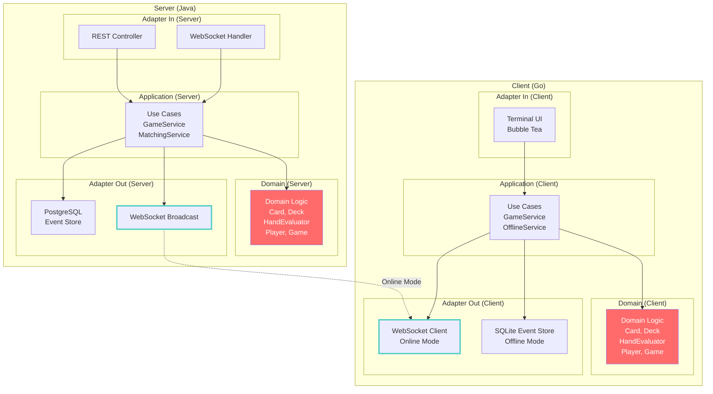
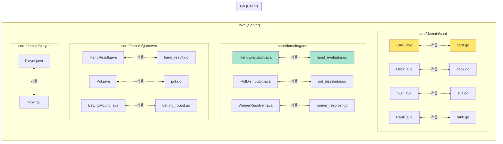
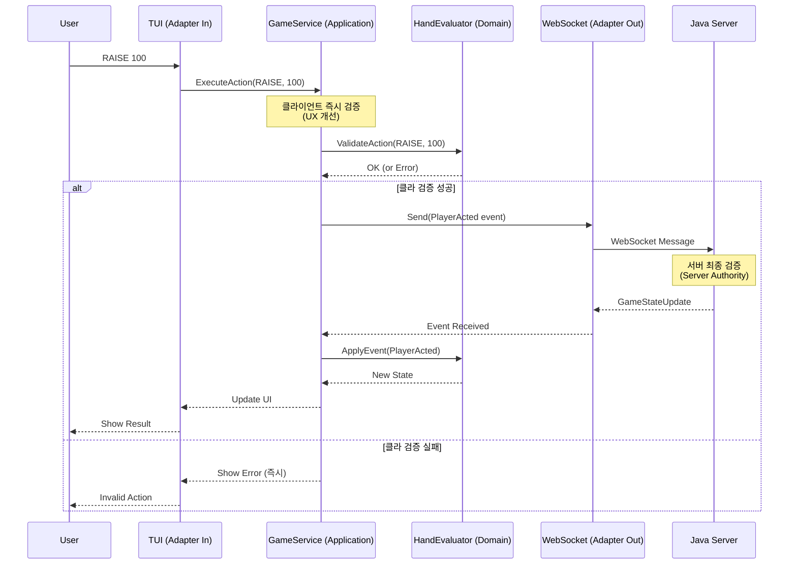
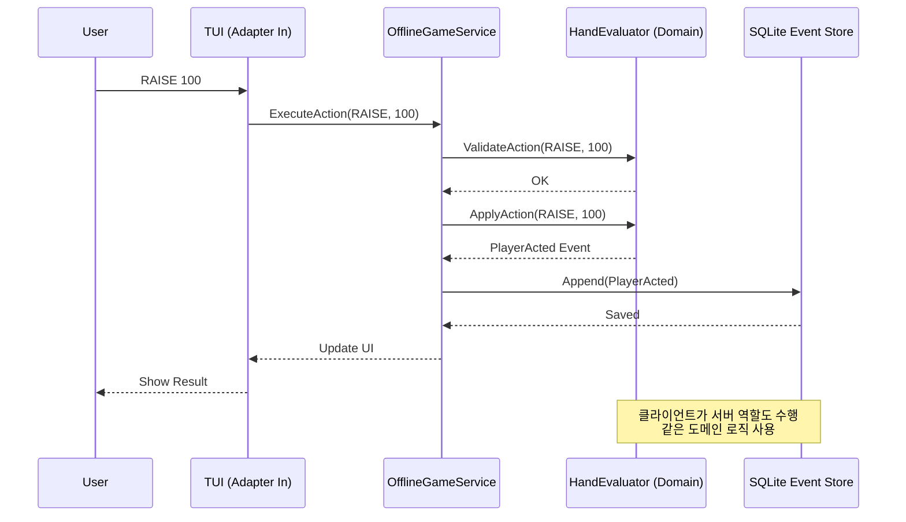
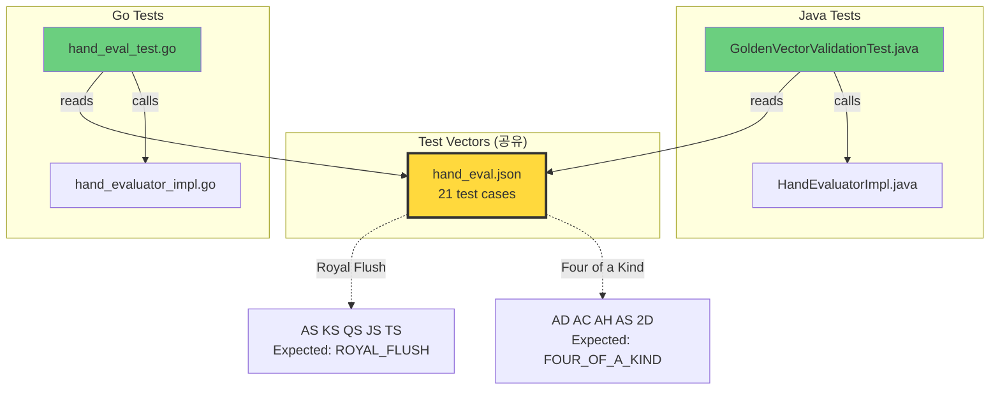
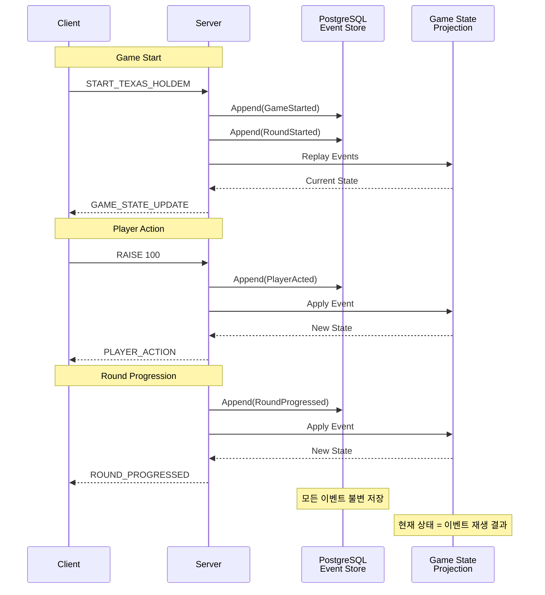
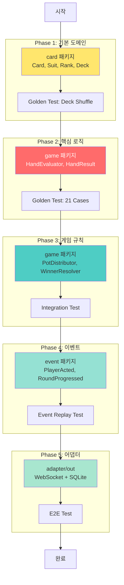
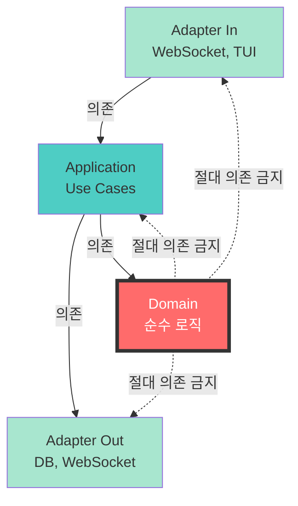

# PokerHole Architecture Storyboard

**목적**: 서버(Java)와 클라이언트(Go)의 헥사고날 아키텍처 "거울" 설계

---

## 1. 헥사고날 아키텍처 전체 구조



**핵심 원칙**:
- 🔴 **Domain Layer (빨강)**: 순수 로직, 프레임워크 의존성 ZERO
- 🔵 **Application Layer**: Use Cases, Port 인터페이스
- 🟢 **Adapter Layer**: 외부 세계와의 연결 (UI, DB, Network)

---

## 2. 서버-클라이언트 도메인 매핑 (거울 구조)



---

## 3. 온라인 vs 오프라인 모드 플로우

### 3.1 온라인 모드 (Server Authority)



### 3.2 오프라인 모드 (Client Authority)



---

## 4. 패키지 구조 상세 (거울 매핑)

### 4.1 서버 (Java)

```
pokerhole-server/src/main/java/dev/xiyo/pokerhole/
│
├── core/
│   ├── domain/                          # 순수 도메인 (NO Spring)
│   │   ├── card/
│   │   │   ├── Card.java               # Value Object
│   │   │   ├── Deck.java               # Aggregate
│   │   │   ├── Suit.java               # Enum
│   │   │   ├── Rank.java               # Enum
│   │   │   └── Hand.java               # Value Object
│   │   │
│   │   ├── game/
│   │   │   ├── HandEvaluator.java      # Interface
│   │   │   ├── HandEvaluatorImpl.java  # Implementation
│   │   │   ├── PotDistributor.java     # Domain Service
│   │   │   ├── WinnerResolver.java     # Domain Service
│   │   │   ├── GameId.java             # Value Object
│   │   │   ├── GameState.java          # Enum
│   │   │   │
│   │   │   ├── vo/
│   │   │   │   ├── HandResult.java     # Value Object
│   │   │   │   ├── Pot.java            # Value Object
│   │   │   │   ├── SidePot.java        # Value Object
│   │   │   │   ├── BettingRound.java   # Enum
│   │   │   │   └── PlayerAction.java   # Enum
│   │   │   │
│   │   │   └── event/
│   │   │       ├── GameEvent.java      # Interface
│   │   │       ├── RoundStarted.java   # Event
│   │   │       ├── PlayerActed.java    # Event
│   │   │       ├── RoundProgressed.java# Event
│   │   │       └── RoundEnded.java     # Event
│   │   │
│   │   ├── player/
│   │   │   ├── Player.java             # Aggregate
│   │   │   ├── PlayerRecord.java       # Entity
│   │   │   └── vo/
│   │   │       ├── PlayerId.java       # Value Object
│   │   │       ├── Nickname.java       # Value Object
│   │   │       └── PlayerStatus.java   # Enum
│   │   │
│   │   └── shared/
│   │       ├── DomainEvent.java        # Interface
│   │       └── AggregateRoot.java      # Base Class
│   │
│   └── application/                     # Use Cases
│       ├── port/
│       │   ├── in/                     # Driving Ports
│       │   │   └── game/
│       │   │       ├── StartGameUseCase.java
│       │   │       └── ExecuteActionUseCase.java
│       │   │
│       │   └── out/                    # Driven Ports
│       │       ├── EventPublisher.java
│       │       └── GameRepositoryPort.java
│       │
│       └── service/
│           ├── GameCommandService.java
│           └── MatchingService.java
│
└── adapter/                             # Adapters
    ├── in/                             # Driving Adapters
    │   ├── websocket/
    │   │   └── GameWebSocketHandler.java
    │   └── rest/
    │       └── GameController.java
    │
    └── out/                            # Driven Adapters
        ├── persistence/
        │   └── JpaGameRepository.java
        └── event/
            └── SpringEventPublisher.java
```

### 4.2 클라이언트 (Go) - 목표 구조

```
pokerhole-cli/
│
├── cmd/
│   └── poker-client/
│       └── main.go                     # Entry Point
│
└── internal/
    ├── core/
    │   ├── domain/                     # 순수 도메인 (NO 외부 의존성)
    │   │   ├── card/
    │   │   │   ├── card.go            # ← Card.java 거울
    │   │   │   ├── deck.go            # ← Deck.java 거울
    │   │   │   ├── suit.go            # ← Suit.java 거울
    │   │   │   ├── rank.go            # ← Rank.java 거울
    │   │   │   └── hand.go            # ← Hand.java 거울
    │   │   │
    │   │   ├── game/
    │   │   │   ├── hand_evaluator.go       # ← HandEvaluator.java 거울
    │   │   │   ├── hand_evaluator_impl.go  # ← HandEvaluatorImpl.java 거울
    │   │   │   ├── pot_distributor.go      # ← PotDistributor.java 거울
    │   │   │   ├── winner_resolver.go      # ← WinnerResolver.java 거울
    │   │   │   ├── game_id.go              # ← GameId.java 거울
    │   │   │   ├── game_state.go           # ← GameState.java 거울
    │   │   │   │
    │   │   │   ├── vo/
    │   │   │   │   ├── hand_result.go      # ← HandResult.java 거울
    │   │   │   │   ├── pot.go              # ← Pot.java 거울
    │   │   │   │   ├── side_pot.go         # ← SidePot.java 거울
    │   │   │   │   ├── betting_round.go    # ← BettingRound.java 거울
    │   │   │   │   └── player_action.go    # ← PlayerAction.java 거울
    │   │   │   │
    │   │   │   └── event/
    │   │   │       ├── game_event.go       # ← GameEvent.java 거울
    │   │   │       ├── round_started.go    # ← RoundStarted.java 거울
    │   │   │       ├── player_acted.go     # ← PlayerActed.java 거울
    │   │   │       ├── round_progressed.go # ← RoundProgressed.java 거울
    │   │   │       └── round_ended.go      # ← RoundEnded.java 거울
    │   │   │
    │   │   ├── player/
    │   │   │   ├── player.go               # ← Player.java 거울
    │   │   │   ├── player_record.go        # ← PlayerRecord.java 거울
    │   │   │   └── vo/
    │   │   │       ├── player_id.go        # ← PlayerId.java 거울
    │   │   │       ├── nickname.go         # ← Nickname.java 거울
    │   │   │       └── player_status.go    # ← PlayerStatus.java 거울
    │   │   │
    │   │   └── shared/
    │   │       ├── domain_event.go         # ← DomainEvent.java 거울
    │   │       └── aggregate_root.go       # ← AggregateRoot.java 거울
    │   │
    │   └── application/                    # Use Cases
    │       ├── port/
    │       │   ├── in/                     # Driving Ports
    │       │   │   └── game/
    │       │   │       ├── start_game.go
    │       │   │       └── execute_action.go
    │       │   │
    │       │   └── out/                    # Driven Ports
    │       │       ├── event_publisher.go
    │       │       └── game_repository.go
    │       │
    │       └── service/
    │           ├── online_game_service.go   # 온라인 모드
    │           └── offline_game_service.go  # 오프라인 모드
    │
    └── adapter/                            # Adapters
        ├── in/                             # Driving Adapters
        │   └── tui/
        │       ├── game_view.go            # Bubble Tea UI
        │       ├── lobby_view.go
        │       └── model.go
        │
        └── out/                            # Driven Adapters
            ├── websocket/
            │   └── client.go               # 온라인 모드
            └── storage/
                ├── sqlite_event_store.go   # 오프라인 모드
                └── migrations/
```

---

## 5. Golden Test 매핑



**검증 원칙**:
- 같은 JSON 파일을 양쪽에서 읽음
- 같은 입력 → 같은 출력 (언어 무관)
- 하나라도 다르면 테스트 실패

---

## 6. 이벤트 소싱 플로우



---

## 7. 타입 매핑 가이드

| 개념 | Java | Go | 비고 |
|------|------|----|------|
| **불변 값 객체** | `record` 또는 `final class` | `struct` (unexported fields) | |
| **열거형** | `enum` | `type + const + iota` | |
| **인터페이스** | `interface` | `interface` | Go는 암시적 구현 |
| **에러 처리** | `throw Exception` | `return error` | |
| **Optional** | `Optional<T>` | `*T` (nullable) 또는 `(T, error)` | |
| **리스트** | `List<T>` | `[]T` (slice) | |
| **맵** | `Map<K, V>` | `map[K]V` | |
| **Getter** | `getSuit()` | `Suit()` | Go는 Get 접두사 생략 |
| **생성자** | `new Card(suit, rank)` | `NewCard(suit, rank)` | |

---

## 8. 구현 우선순위



---

## 9. 핵심 원칙 요약

### 9.1 의존성 규칙



**규칙**:
- ✅ Domain은 **아무것도 의존하지 않음**
- ✅ Application은 Domain만 의존
- ✅ Adapter는 Application과 Domain 의존 가능
- ❌ Domain이 Framework/Library 의존 = 아키텍처 위반

### 9.2 거울 원칙

| 항목 | 서버 (Java) | 클라 (Go) | 동일해야 하는 것 |
|------|------------|----------|-----------------|
| 개념 | ✅ | ✅ | 타입명, 역할, 책임 |
| 구조 | ✅ | ✅ | 패키지 계층, 파일 위치 |
| 인터페이스 | ✅ | ✅ | 공개 메서드 시그니처 |
| 결과 | ✅ | ✅ | Golden Test 출력값 |
| 구현 | ❌ | ❌ | 언어별 이디엄 다름 |

---

## 10. 다음 단계

### 10.1 즉시 시작 가능

1. **card 패키지 구현** (Go)
   - `suit.go`, `rank.go`, `card.go`, `deck.go`
   - Java 코드 보면서 번역
   - Golden Test 작성 (Deck Shuffle)

2. **HandEvaluator 구현** (Go)
   - `hand_evaluator.go`, `hand_result.go`
   - 21개 Golden Test 벡터 검증

3. **오프라인 모드 구현**
   - SQLite Event Store
   - 이벤트 재생 로직
   - TUI 연결

### 10.2 검증 기준

| Phase | 검증 방법 | 합격 기준 |
|-------|----------|----------|
| Phase 1 | Deck Shuffle Golden Test | Java와 같은 시드 → 같은 카드 순서 |
| Phase 2 | HandEvaluator 21 Cases | 모든 테스트 통과 (100%) |
| Phase 3 | Pot Distribution Test | Side Pot 계산 일치 |
| Phase 4 | Event Replay Test | 같은 이벤트 스트림 → 같은 최종 상태 |
| Phase 5 | E2E Test | 온라인/오프라인 모두 게임 완료 |

---

## 참고 자료

- **CLAUDE.md**: 작업 규칙, 컨벤션
- **ROADMAP.md**: 현재 상태, 다음 단계
- **ADR-001**: Event Sourcing 설계 결정
- **ADR-002**: Server Authority 설계 결정
- **ADR-005**: Deterministic RNG 설계 결정

---

**Last Updated**: 2025-10-04
**Status**: Architecture Design Complete, Ready for Implementation
